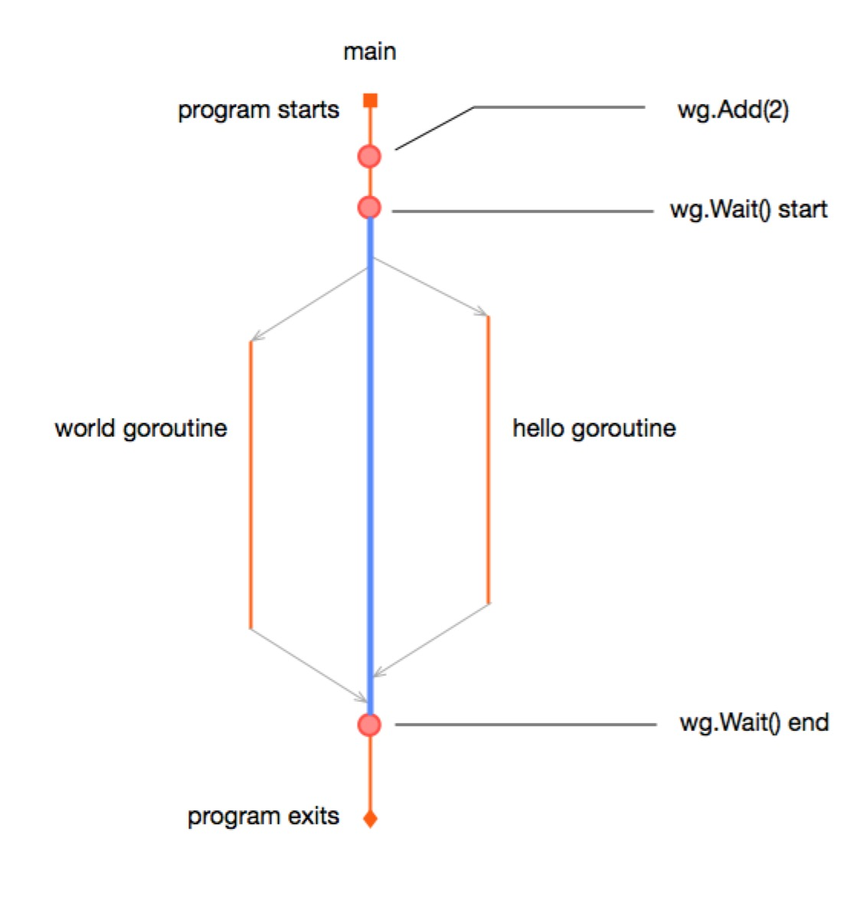

# 等待 goroutine 结束

在上一节，我们介绍了如何启动 goroutine，并通过 sleep 一段时间来等待 goroutine 执行完成，并解释了这种方案的缺点。
那么这一节，我们会学习 go 语言提供的方案，来等待 goroutine 执行结束。

go 标准库提供了 `sync` 包来解决各种需要同步的问题，而我们只需要用到 `sync.WaitGroup`。

从名字来看，可以把 `WaitGroup` 理解成等待（wait）一组（group） goroutine ，它会维护一个计数器，当有 goroutine 运行时，把这个信息告诉 WaitGroup，
WaitGroup 就知道有多少个 goroutine 在运行；当某个 goroutine 运行结束时，也告诉 WaitGroup，WaitGroup 就知道有多少 goroutine 运行结束。
当执行等待函数时，WaitGroup 如果发现还有 goroutine 没有执行完成（计数器不是 0 ）就阻塞，如果 goroutine 都已经执行完成就直接返回。

还是拿上一节的例子，来看一下使用 `WaitGroup` 之后的代码：

```go
package main

import (
	"fmt"
	"sync"
	"time"
)

func worker(name string, wg *sync.WaitGroup) {
	for i:=0; i<10; i++ {
		fmt.Println(name)
		time.Sleep(time.Millisecond * 10)
	}
	wg.Done()
}

func main() {
	wg ：= sync.WaitGroup{}

	wg.Add(2)
	go worker("hello", &wg)
	go worker("world", &wg)

	wg.Wait()
}
```

编译运行，结果还是和上一节一样：随机地打印 `hello` 和 `world` 字符串，但区别是程序运行时间会明显小于 2 秒，比如我机器上运行只需要 `0.20s`：

```bash
➜  wait-goroutine time go run main.go
world
hello
hello
......

go run main.go  0.20s user 0.15s system 80% cpu 0.436 total
```

这段代码和原来的代码结构相同，只是添加了 WaitGroup 的逻辑：在运行 goroutine 之前，定义了 `WaitGroup` 变量，并调用了 `Add` 方法，因为我们实现知道了会运行多少个 goroutine，所以直接把计数器增加了对应的次数；
worker 函数添加了一个 `wg` 参数，并在 goroutine 执行完成时调用 `Done()` 方法，最后是 main 函数调用 `Wait()` 方法等待 goroutine 执行结束。


`WaitGroup` 是一个结构体，定义在 `sync` 库里，它没有对外公开的字段，因此初始化非常简单： `sync.WaitGroup{}`。

`WaitGroup` 一共对外暴露了三个方法：

- `Add()`：接收一个整数作为参数，表示对计数器进行修改，一般为正数，表示有多少个 goroutine 要运行，也可以为负数，表示有多少个 goroutine 运行完成。如果参数导致计数器为负，则会直接 panic
- `Done()`：功能和 `Add(-1)` 相同，表示有一个 goroutine 运行完成，一般在 goroutine 最后调用
- `Wait()`：等待 `WaitGroup` 中注册的 goroutine 全部运行完成，也就是计数器为 0。如果计数器大于 0，这个操作会一直阻塞，一旦发现计数器为 0，就立即返回


可以看到， WaitGroup 并不会自动感知 goroutine 的运行状态，而是需要我们在执行之前和之后告诉它 goroutine 要运行和运行结束了，它只是保证并发安全地计数，并提供阻塞功能。我们会认为 goroutine 一定会创建成功，并且在创建之前就调用 `Add()` 方法，保证它在 `Wait()` 方法之前运行，而 `Done()` 方法是在 goroutine 运行结束之前立即调用的，正常情况下不要使用 `wg.Add(-3)` 这种把负数传给 `Add` 的用法。

**注意事项**: 因为在 worker 执行完成是要调用 `wg.Done()`，所以我们添加了一个参数把 `wg` 传给它。**如果要传递 `WaitGroup` 的话，一定要使用指针**。如果不适用指针，go 会对原来的变量进行值传递，复制一个新的值传递给函数，执行 `Done()` 操作原来的 wg 变量也不会知道。如果把上面代码指针改成值传递，运行会出现死锁，因为 main goroutine `wg` 一直认为还有两个 goroutine 在等待，所以会一直阻塞在 `Done()` 调用上。

虽然，上面的方案已经满足了我们的需求，但是有个不好的地方，那就是修改了原来的 worker 函数，把 WaitGroup 相关的控制逻辑和业务逻辑耦合在一起。利用 go 语言函数的灵活功能，我们可以封装一个匿名函数，把 WaitGroup 的逻辑封装在这层函数里：


```go
package main

import (
    "fmt"
    "sync"
    "time"
)

func worker(name string) {
    for i:=0; i<10; i++ {
        fmt.Println(name)
        time.Sleep(time.Millisecond * 10)
    }
}

func main() {
    var wg = sync.WaitGroup

    wg.Add(2)
    go func() {
        worker("hello")
        wg.Done()
    }()

    go func() {
        worker("world")
        wg.Done()
    }()

    wg.Wait()
}
```

程序的运行示意图如下：



可以看到，原来的 worker 函数完全不需要任何改动，这是比较推荐的做法，你会在很多 go 语言的代码库中看到类似的用法。

另外一个需要注意的事项 `wg.Done()` 一般在 goroutine 运行之前就添加，如果不小心把它放到 goroutine 中，可能会遇到 `Add` 还没有执行就运行到 `wg.Wait()`，这时候因为计数器还是 0，main 函数就继续执行并退出了。感兴趣的读者可以把上面例子 `wg.Add(2)` 放到 goroutine 中测试一下，看看会出现什么结果。

另外一个留给读者思考的问题是，如果在调用 `wg.Add` 的时候搞错参数，写成了 `wg.Add(1)`，会出现什么情况呢？为什么？
