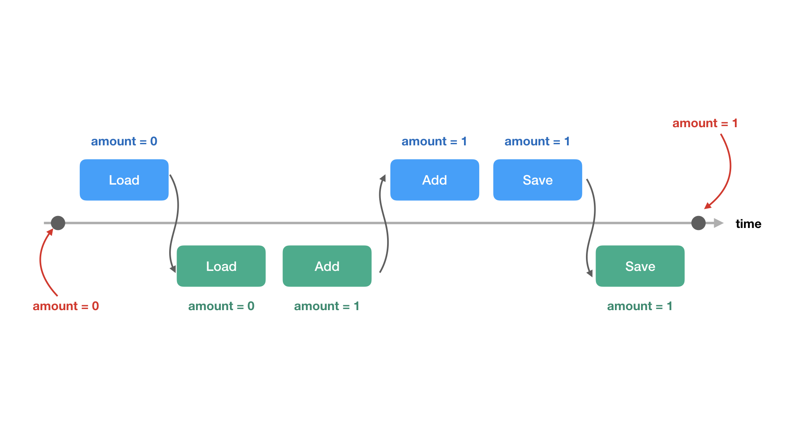

# 竞争条件（race condition）

## 问题描述

在介绍锁机制之前，我们先来解释一下 goroutine 在读写共享变量的时候会出现什么问题，我们使用最经典的银行转账作为例子来进行说明。

假如 Alice 在银行开始了一个账户，并每个月往里面存钱。简单模拟这个场景的话，可以定义一个 `Account` 结构体表示个人银行账户，提供 `Deposit()` 和 `Balance()` 两个方法，分别代表存钱，和查看账户余额。

```
// Account 代表某个人的银行账户，有用户名和余额两个字段
type Account struct {
    name string
    amount uint32
}

// Deposit 往账户里面存特定数量的钱
func (a *Account) Deposit(amount uint32) {
    a.amount = a.amount + amount
}

// Balance 返回账户里还有多少余额
func (a *Account) Balance() uint32 {
    return a.amount
}
```

在 main 入口函数中，创建出来一个账户，运行两个 worker 一直往账户里存钱（这里省略了等待 goroutine 运行完成的逻辑）：

```
a := &Account{name: “Alice”, amount: 0}

go worker(a)       
go worker(a)
```

worker 的功能很简单，就一个 for 循环，每次往账户里面存 1 块钱：

```
func worker(a *Account){
    for i:=0; i<100000; i++ {
        a.Deposit(1)
    }
}
```

整个代码很简单，逻辑非常清晰，完整的代码如下：

```
package main

import (
    "fmt"
    "sync"
)

type Account struct {
    name string
    amount uint32
}

func (a *Account) Deposit(amount uint32) {
    a.amount = a.amount + amount
}

func (a *Account) Balance() uint32 {
    return a.amount
}

func worker(a *Account){
    for i:=0; i<100000; i++ {
        a.Deposit(1)
    }
}

func main() {
    a := &Account{name: "cizixs", amount: 0}
    var wg sync.WaitGroup

    wg.Add(2)
    go func(){
        worker(a)
        wg.Done()
    }()

    go func(){
        worker(a)
        wg.Done()
    }()

    wg.Wait()

    fmt.Println(a.Balance())
}
```

对于 Alice 来说，辛辛苦苦每次存 1 块钱，最后希望账户里有 200,000 块。但是运行上面的程序，你会发现，最终看到的结果很可能少于 20 万，在我的机器上多次运行的结果如下：

```
➜  race git:(master) ✗ go run main.go
110155
➜  race git:(master) ✗ go run main.go
101187
➜  race git:(master) ✗ go run main.go
100287
➜  race git:(master) ✗ go run main.go
101189
```

不仅少，而且少得可怜，账户里最终只有大约一半的钱。那么，我们要帮 Alice 查一下，钱怎么就没了呢？

## 数据竞争

首先在代码中，只有一个地方对账户中的金额进行了修改：

```
a.amount = a.amount + amount
```

这句话只有一行，就是把账户余额加上刚存进去的钱。虽然有两个 goroutine 在运行，按照直觉，不管它们怎么调度，每个 goroutine 执行到都会把钱加上去，即使调度回去，另外一个 goroutine 就能看到刚加进去的余额了。

问题在于，对于代码只有一句话，但对于计算机来说要执行的指令却有多条。要完成存钱的逻辑，计算机首先会读取 `a.amount` 的值，然后执行加法运行，最后把结果复制给 `a.amount`，并不是一步完成的。如果一个 goroutine 在执行中间某个步骤时，go runtime 进行了调度，把 CPU 让给了另外一个 goroutine，就会余额减少的情况。

为了容易理解，我们再把事情简化一下，只考虑最开始账户余额为 0 时，两个 goroutine 运行过程中发生调度的情况，而且只有一个 CPU 的情况（不会出现两个 gorotuine 同时运行在不同 CPU 的情况）。如下图所示：



中间横轴为时间线，时间线上下蓝色和绿色的方框分别代表两个 goroutine 运行存钱逻辑的不同阶段：读取当前余额、把余额加一、和把计算值保存会余额三个动作。

- 最开始，账户余额为 0 元
- goroutine A 执行了读取操作，得到的值为 0
- 然后 goroutine 发生调度，切换到另外一个 goroutine B 运行，它读取的余额也是 0，并执行了加一操作，此时它保存了 amount = 1 的数据在自己的状态
- 调度再次发生，切换到 goroutine A，它之前读取的余额值为 0，执行加一操作变成 1，然后保存到账户余额中，此时余额为 1
- 又发生调度，goroutine B 把数据之前保存的余额为 1 写回到账户，账户的余额还是 1

可以看到，虽然两个 goroutine 执行了两次加一操作，但是最终的账户余额只增加了一元。这就是 Alice 账号上没有期望金额的原因，在两个 goroutine 执行大量并发存钱时，每次出现上面的情况账户就会少 1 元钱。

这种现象被称为数据竞争（data race），当两个或者多个 goroutine 并发地去操作一个共享的变量，而且至少一个 goroutine 的操作为写时，就会发生。

## 解决方案

对于数据竞争的问题，解决方案分为三种，下面就分别来讲一下。

### 1. 不要写变量

既然数据并发需要至少一个 goroutine 对数据执行写操作，在 goroutine 运行的时候不进行写数据的操作就行了。只要把写操作放在 goroutine 运行之前就执行完，在 goroutine 中只执行读操作，就不会出现问题了。

这种方法使用的情况比较少，但是思想却很重要。如果某些操作可以在初始化的时候做掉，那么就不会放到   goroutine 中并发地去运行。

### 2. 不要在多个 goroutine 中读写变量

数据竞争是由于多个 goroutine 并发地对某个数据执行读写操作到处的，另外一个可以想到的方案就是不要把数据共享。把数据的归属权放到某个特定的 goroutine 中，如果另外的 goroutine 要对变量进行读写，就通过 channel 把数据传递过去，其实这就是我们之前一直讲述的 channel 方式，也是 go 社区那句著名的“不要通过共享内存来通信，而是通过通信来共享内存”思想。

> Do not communicate by sharing memory, sharing memory by communicating.

### 3. 运行多个 goroutine 读写变量，但每次只有一个 goroutine 能操作

最后一种解决方案是这样的，既然数据竞争是因为多个 goroutine 交替执行关键指令导致的，那只要某个 goroutine 执行指令不中断，也就不会出现问题了。比如上面银行账户的问题，如果每个 goroutine 都是执行完 load、add、save 操作才发生调度，结果也不会出现混乱。

这就是我们接下来要讲的锁机制，对某些操作（多个指令）加锁，只有某个 goroutine 执行完加锁的内容，才运行其他 goroutine 运行。
