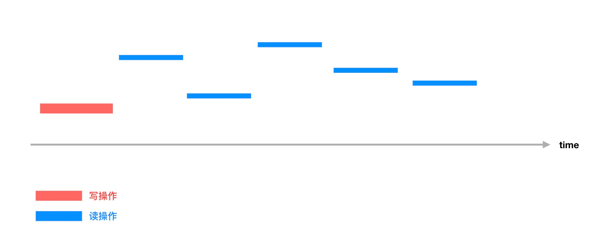
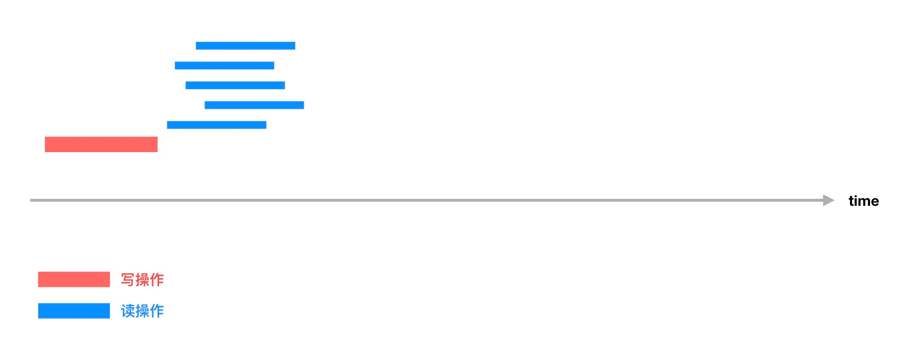

# 读写锁

互斥锁的核心思想在于每次只有一个并发实体能够访问共享的变量，不管是执行读操作还是写操作。
虽然能达到并发安全的需求，但是却给性能带来很大的影响，在上节的最后我们对此进行过测试。
只要使用锁就避免不了性能的损耗，除了控制锁的粒度尽可能小之外，还有一种办法可以减缓这种问题，
那就是这节要讲的读写锁。

在竞争条件那部分我们讲到数据竞争的条件是多个 goroutine 并发操作共享变量，并且至少一个操作为写。
后面这个条件非常关键，因为并发地读取操作并不会出现数据不一致的问题。可以利用这个特性把读操作
的锁和写操作的锁分开，从而提升整个系统的性能。这就是读写锁的思想。

读写锁允许多个读操作同时进行，但是每次只允许一个写操作（不支持多个写操作，也不支持读操作和写操作同时进行）。

如果说互斥锁是通过加锁实现并发读写操作串行化：



那么，读写锁就是通过读锁和写锁分离来达到并发读操作的性能优化：



从上面两张对比图可以看出，原来多个读需要等待前面一个读解锁之后才能继续，它们只能串行运行；
使用读写锁之后，多个读操作可以同时进行，从而减少了整个的运行时间。不难知道，**读写锁适用于读多写少的场景**，
而且读写比例差距越大，性能优化越明显。反过来，如果是读少写多，那么性能改进并不明显，极端情况下，写操作
比读操作频繁很多，读写锁和互斥锁性能基本没有太大差别。

## go 语言读写锁

读写锁在 go 语言中是通过 `sync.RWMutex` 实现的，从名字上也可以看出，它是在上一节讲到的互斥锁 `Mutex` 前面加上 `RW`（Read-Write 缩写） 前缀。
这个结构体一共提供了下面几种方法:

```
type RWMutex
    func (rw *RWMutex) Lock()      // 获取写锁，如果系统中读锁或者写锁已经在使用中，那么该操作会一直阻塞，直到写锁可用
    func (rw *RWMutex) Unlock()    // 释放写锁，如果写锁没有被加锁，则会报 runtime error

    func (rw *RWMutex) RLock()     // 获取读锁, 只要系统中写锁没有在使用中，就能获取成功。也就是说允许多个 goroutine 获取读锁 
    func (rw *RWMutex) RUnlock()   // 释放读锁，如果读锁没有被加锁，则会报 runtime error

    func (rw *RWMutex) RLocker() Locker // 返回一个 `Locker` 接口实现，它的 `Lock()` 和 `Unlock()` 方法就是调用 `rw.RLock()` 和 `rw.RUnlock()`.
                                        // 换句话说，这只是一个快捷操作
```

也就是说，对写操作部分使用和之前一样，只是额外增加了两个方法用来为读操作加锁和解锁而已。

使用读写锁，系统的状态可以分成三种：

- 空闲状态：没有任何的读操作或者写操作
- 读状态：系统中有**一个或者多个读操作**在执行
- 写状态：系统中有**一个写操作在执行**

当处于空闲状态或者读状态时，获取读锁的操作是可以成功的，因为读写锁允许多个读操作；
当处于空闲状态时，获取写锁的操作是可以成功的，因为系统中写操作是互斥的，只能存在一个，而且不能和读操作并存。

## 银行账户重写

这部分，我们用读写锁重写前一节银行账户的例子，以提升其性能。

因为银行账户的例子读写就是分开的，存钱是写操作，查看余额是读操作，因此改成读写锁改动的地方很少。
首先是把 `sync.Mutex` 改成 `sync.RWMutex`，其次是查看余额的时候加锁和解锁的对象是读写锁中的读锁，
使用的方法是 `mu.RLock()` 和 `mu.RUnlock()`，而写锁不需要改动，依旧是 `mu.Lock()` 和 `mu.Unlock()`。

```
type Account struct {
    name   string
    amount uint32
    mu     sync.RWMutex
}

func (a *Account) Deposit(amount uint32) {
    a.mu.Lock()
    defer a.mu.Unlock()
    a.amount = a.amount + amount
}

func (a *Account) Balance() uint32 {
    a.mu.RLock()
    defer a.mu.RUnlock()
    return a.amount
}
```

最后再来看看性能测试的结果，我们不能直接使用之前的 benchmark 代码，因为里面只有读取余额的行为，使用互斥锁还是读写锁并没有明显的差别。
我们这次使用的 benchmark 代码如下：

```
func BenchmarkAccount(b *testing.B) {
    a := Account{name: "cizixs", amount: 0}

    var wg sync.WaitGroup

    // 启动 100 个 goroutine，并发读取账户里的余额
	// 每个 goroutine 操作次数是 b.N，也就是 benchmark 设定的一个很大的一个数值
    wg.Add(100)
    for i := 0; i < 100; i++ {
        go func() {
            for i := 0; i < b.N; i++ {
                a.Balance()
            }
            wg.Done()
        }()
    }

    wg.Add(10)
    // 启动 10 个 goroutine，并发往账户里存钱
    // 每个 goroutine 操作的次数是 b.N/10000，比读操作少很多
    for i := 0; i < 10; i++ {
        go func() {
            for j := 0; j < b.N/10000; j++ {
                a.Deposit(1)
            }
            wg.Done()
        }()
    }

    wg.Wait()
}
```

代码会分别启动读 goroutine 和 写 goroutine，读操作的 goroutine 不仅数量多，而且每次的操作次数更多，也就是说我们在模拟一个读多写少的场景。

互斥锁实现的程序性能测试结果如下，需要关注的数据是每次操作耗时，这次是 `21423 ns/op`：

```
➜  exclusive-lock git:(master) ✗ go test -test.bench=".*" .
goos: darwin
goarch: amd64
pkg: github.com/cizixs/playground/lock/exclusive-lock
BenchmarkAccount-4        100000             21423 ns/op
PASS
ok      github.com/cizixs/playground/lock/exclusive-lock        2.377s
```

读写锁实现的程序性能测试结果如下，单次操作耗时为 `7497 ns/op`：

```
➜  read-write-lock git:(master) ✗ go test -test.bench=".*" .
goos: darwin
goarch: amd64
pkg: github.com/cizixs/playground/lock/read-write-lock
BenchmarkAccount-4        300000              7497 ns/op
PASS
ok      github.com/cizixs/playground/lock/read-write-lock       2.322s
```

可以看到读写锁的性能大概是互斥锁实现的三倍左右，确实和期望一样。
